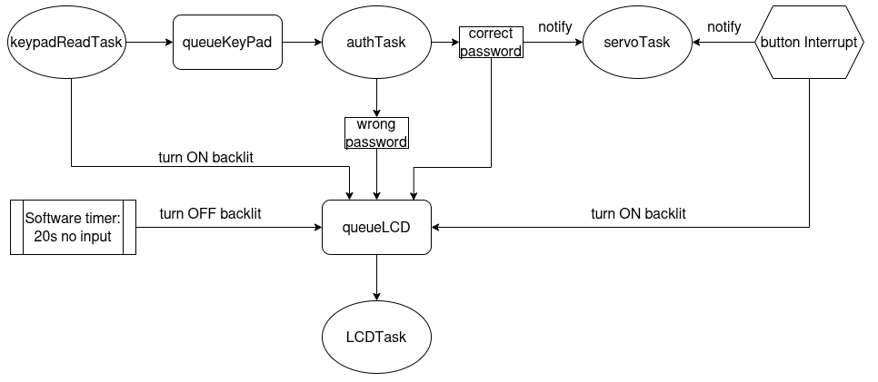

# Smart-Lock
## 1. Overview

This project implements a smart lock system utilizing the **ESP32-C3-DevKit-M-1** board. The entire application using the **ESP-IDF** (Espressif IoT Development Framework).

## 2. Software Architecture

The firmware is built using the **FreeRTOS** real-time operating system to manage concurrent processes efficiently.

Key FreeRTOS features used include:

* **Tasks:** Used to handle primary logic, communication, and hardware control.
* **Queues:** Used for safe, asynchronous data passing between tasks.
* **Task Notifications:** Employed for efficient signaling and synchronization between tasks.
* **Software Timers:** Used for scheduling periodic and delayed actions.
* **Interrupts:** Configured to handle time-critical, external hardware events immediately.

## 3. Project Workflow

---

## 4. Get Started

The project can be built and flashed using the standard ESP-IDF workflow (e.g., `idf.py build`, `idf.py flash`).
